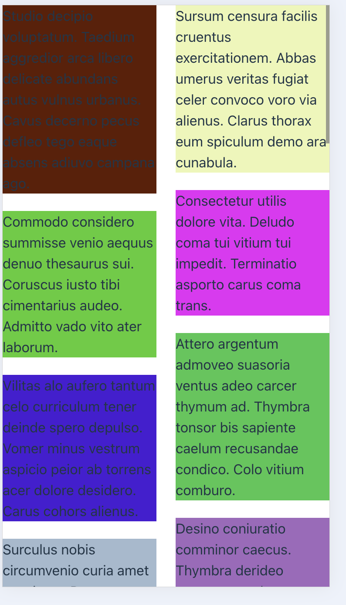
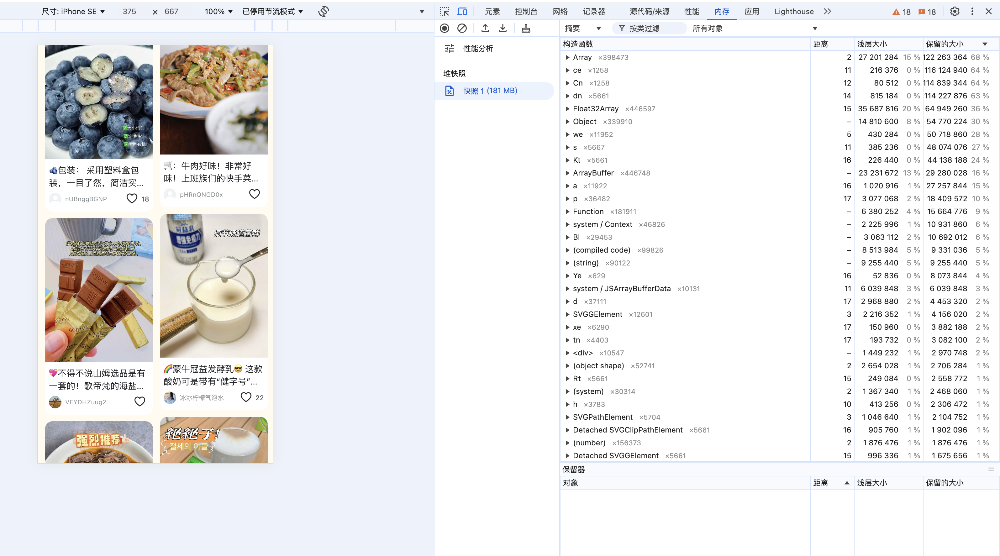

<h1 align="center">一个基于react的虚拟滚动瀑布流组件</h1>
<p>
  <a href="https://www.npmjs.com/package/react-virtual-waterfall" target="_blank">
    
  </a>
  <a href="#" target="_blank">
    
  </a>
</p>

### 🏠 [Homepage](https://www.npmjs.com/package/react-virtual-waterfall)

## Install

```sh
npm install
```

## Scene

适用场景：需要渲染一个分页无限滚动，且每个卡片元素不定高的瀑布流列表时，可以使用该组件

## Usage

```sh
npm run dev
```

该命令将启动一个使用示例



## Performance

在瀑布流卡片较多时，能够带来内存上的开销节省。

### Normal display



### Virtual scroll


经项目实测，在滚动 8 万像素左右时，能够节省 70%的内存消耗。

## Props

| propName          | dataType                                  | required | defaultValue       | description                                    |
| ----------------- | ----------------------------------------- | -------- | ------------------ | ---------------------------------------------- |
| dataSource        | any[]                                     | Yes      | []                 | list data                                      |
| style             | React.CSSProperties                       | No       |                    | CSS Style                                      |
| renderItem        | (index: number, data: any) => ReactNode;  | YES      |                    | Function to render list item                   |
| onScroll          | (e: scrollEvent) => void                  | No       |                    | container scroll event                         |
| columnCount       | number                                    | No       | 2                  | waterfall column count                         |
| columnGap         | number                                    | No       | 0                  | waterfall column gap(px)                       |
| scrollThreshold   | number                                    | No       | 1                  | scroll rate to call next function([0,1])       |
| rowGap            | number                                    | No       | 0                  | waterfall row gap(px)                          |
| next              | () => void                                | No       |                    | scroll to page end                             |
| averageItemHeight | number                                    | No       | 40                 | estimated height of list item                  |
| showLoader        | boolean                                   | No       | false              | Does container display loader                  |
| getItemHeight     | (index: number) => number                 | Yes      |                    | Function to get list item real height on dom   |
| end               | boolean                                   | No       | false              | Does container display endMessage              |
| loader            | React.ReactNode                           | No       |                    | container loader element                       |
| endMessage        | React.ReactNode                           | No       |                    | container endMessage element                   |
| skeleton          | React.ReactNode                           | No       |                    | before request, container will render skeleton |
| skeletonCount     | number                                    | No       | 8                  | the quantity of skeleton                       |
| paddingCount      | number                                    | No       | 0                  | the quantity of buffer elements                |
| containerHeight   | number                                    | No       | window.innerHeight | scroll container height                        |
| onItemRendered    | (index: number) => void                   | No       |                    | list item can be visibile                      |
| onItemDispeared   | (index: number, duration: number) => void | No       |                    | list item disappeared                          |
| appearOnce        | boolean                                   | No       | true               | onItemRendered function can be called once     |

## Author

👤 **aplanckfish**

- Github: [@APlanckFish](https://github.com/APlanckFish)

## Show your support

Give a ⭐️ if this project helped you!

---

_This README was generated with ❤️ by [readme-md-generator](https://github.com/kefranabg/readme-md-generator)_
